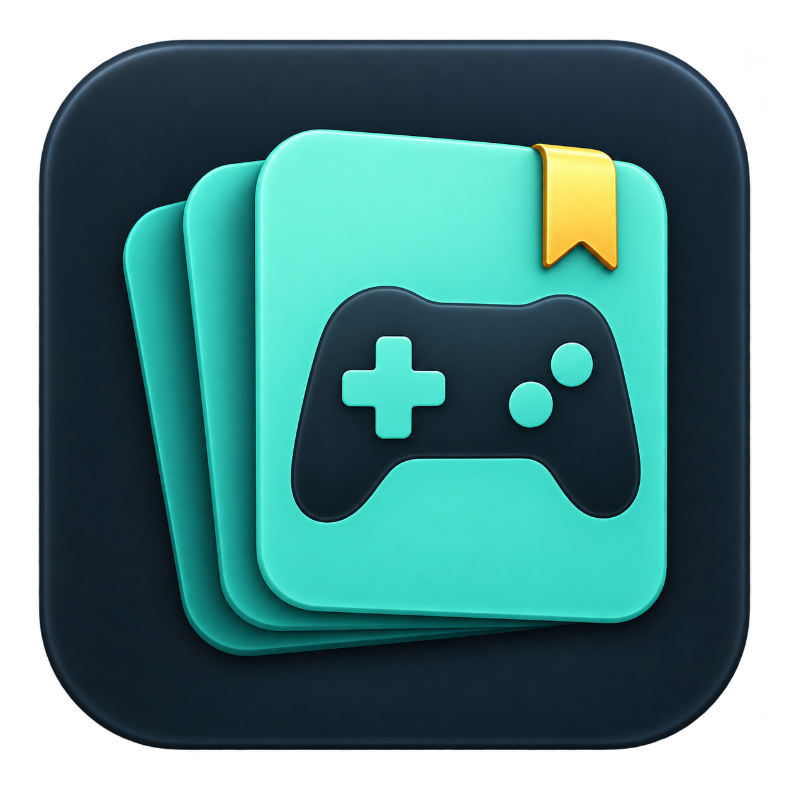
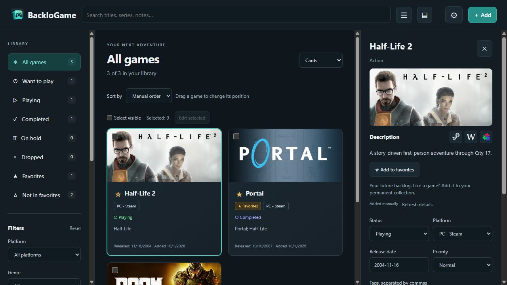
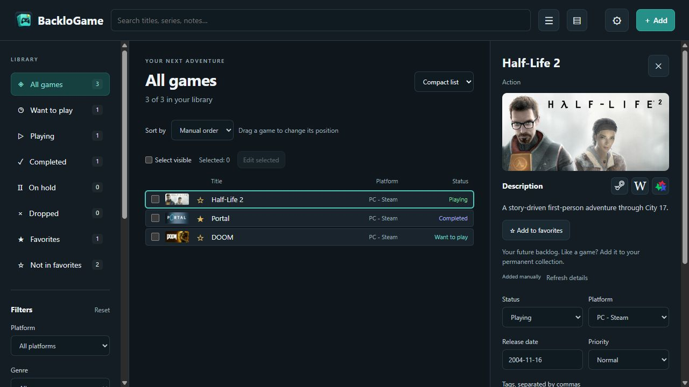

<p align="center"></p>

# BackloGame

A small, portable game backlog for Windows. Track what you want to play,
what you are playing, and what you have finished, with covers, notes, and favorites.

**[Download for Windows](https://github.com/w4rd3ll/BackloGame/releases/latest)** ·
**[По-русски](README.ru.md)** · **[Report a problem](https://github.com/w4rd3ll/BackloGame/issues)**



Demonstration library; progress is illustrative. Downloads start empty.

## Get started

1. Download `BackloGame-0.1.0-windows-x64-portable.zip` from Releases.
2. Extract the entire archive to a writable local folder.
3. Run `BackloGame.exe`. Keep `_internal` beside it.

No BackloGame installer, Python installation, account, or API key is needed.
The app uses the **system Microsoft WebView2 Evergreen Runtime**. If it is
missing, install it once from [Microsoft](https://developer.microsoft.com/microsoft-edge/webview2/).
The download starts with an empty library. English is the default; select
Russian in **Settings → General → Interface language**.

## Features

- Search Steam, Wikipedia, or Metacritic, or add games manually.
- Track progress and favorites; create your own categories and platforms.
- Use cards, a list, or a compact one-line list with small covers.
- Filter by platform, genre, series, tags, and dates; sort or drag into manual order.
- Add notes, tags, priorities, and several series separated by `;`.
- Save covers locally, select a thumbnail crop, and refresh Steam covers.
- Edit multiple games together and collapse the side panels.
- Export and restore full backups. At most **10** ZIP backups are retained.

Catalog search requires Internet. Saved entries, notes, descriptions, and
previously downloaded covers remain available offline. Resource buttons open
external sites in your default browser. This version organizes a backlog;
it does not launch games or synchronize accounts.

<details>
<summary>Compact list preview</summary>



</details>

## Your data

On first launch, BackloGame creates `data` beside the executable. The library,
covers, settings, backups, and window profile stay there.

To move your collection, close the app and copy its entire folder. To update,
close the app, replace `BackloGame.exe` and `_internal`, and **keep `data`**.
Use a folder with write access; do not launch from inside a ZIP.

## Build from source

Windows 11 x64, Python 3.14 x64, and system WebView2 are the tested environment.

1. Run `Setup.cmd` to create `.venv` and install pinned desktop dependencies.
2. Run `Run.cmd` for the desktop app, or `Develop-Browser.cmd` for browser development.
3. Run `Build-Release.cmd` to build the sibling `BackloGame-Release` folder.
4. Run `.venv/Scripts/python.exe tools/package_release.py` to create a clean ZIP
   and SHA-256 checksum in `dist`.

The build refuses to overwrite a release library containing games. Packaging
excludes **all `data`**, including empty databases and browser profiles.
Neither script reads the sibling `BackloGame-Personal` folder.

Tests (run from this source folder):

```text
.venv/Scripts/python.exe -m unittest test_library.py tests/test_storage.py tests/test_desktop_platform.py tests/test_desktop_close.py
node test_filters.cjs
node --expose-internals tests/check-localization.cjs
```

`BACKLOGAME_DATA_DIR` or `--data-dir` selects a separate data folder for testing.
The older `MY_GAMES_DATA_DIR` alias remains accepted. Native windows use separate
local ports. A local HTTP service bound to `127.0.0.1` serves the interface
inside its own desktop window.

## Linux status

Library logic and the HTML/CSS/JavaScript interface are shared. OS-specific setup
is isolated in `desktop_platform.py`. Linux can use a pywebview GTK/WebKit or Qt
backend, but **Linux packaging and real-machine behavior have not been verified**.
The included EXE, build spec, and CMD launchers target Windows only.

## Third-party components

See [component notices](docs/THIRD_PARTY.md) and [included licenses](docs/licenses).
Game artwork and descriptions remain the property of their respective owners.
The download contains no personal game library or game covers.
